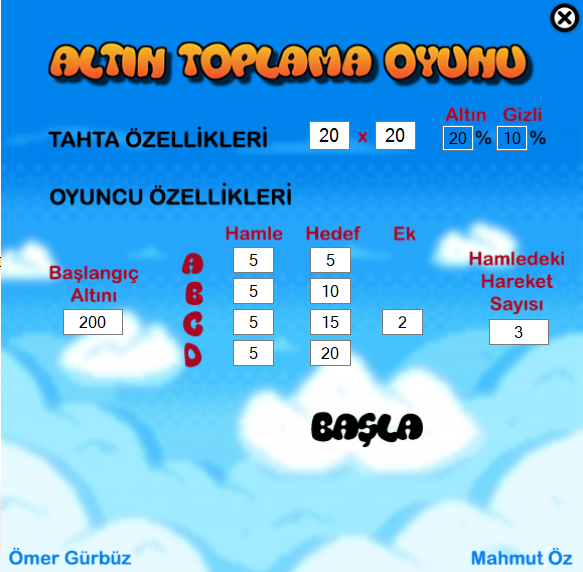
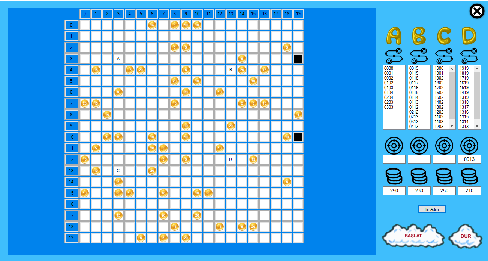

# Gold Collection Game

### Proje hakkında
---
- Bu proje görevleri birbirinden farklı olan 4 farklı kullanıcının, 
boyutları önceden belirlenmiş **n x m** birimlik bir oyun tahtası üzerindeki görünen altınları toplayan basit bir masaüstü oyun projesidir.
 Her oyuncu altınları toplarken farklı strateji uygulamaktadır. Bu farklı stratejilere göre en uygun arama algoritmaları kullanılmaya çalışılmıştır.
 Projede ayrıca iki farklı altın kategorisi bulunmakta olup bunlardan ilki gizli ikincisi açık altın kategorisidir. 
 Oyunculardan herhangi biri bu gizli altınların üzerinden geçerse bu altın tüm oyunculara görünür hale gelecek şekilde düzenlenir. 
 Oyunun sonunda tüm oyuncuların kazandığı, harcadığı altın sayısı ve toplam atılan adım sayısı sonuç olarak ekrana yazdırılır.

### Kurallar
---
1. Oyun 4 oyuncu ile oynanmaktadır.
2. Oyun özdeş karelerden oluşan ve dinamik olarak boyutu belirlenebilen dikdörtgen bir tahta üzerinde gerçekleşir (varsayılan boyutlar: 20x20 kare).
3. Her bir oyuncu tahtanın ayrı bir köşesinden oyuna başlar.
4. Tahtadaki karelerin bir kısmında altın bulunur. Altınlar Karelere rastgele dağılır ve altın bulunan kare sayısı toplam kare sayısının belli bir oranındadır. (Varsayılan olarak %20. Örneğin 400 kare için rastgele 80 kare). Altınların bulunduğu karelerin de varsayılan %10’unda gizli altın bulunur. Bu altınları başlangıçta oyuncular göremeyecektir.
5. Altın bulunan her bir karedeki altın miktarı 5’in katlarından (5 ile 20 arasında) herhangi biridir.
6. Her kullanıcı sırayla hamle yaparak oyunu oynar.
7. Bir oyuncu altın bir karenin üzerinden geçtiğinde altını alır.
8. Her kullanıcının başlangıçta eşit ve belli bir miktar altını bulunmaktadır (varsayılan 200 altın).
9. Altını biten oyuncu elenmektedir.
10. Oyun tüm oyuncuların altını bittiğinde veya karelerde altın tamamen tükendiğinde biter.
11. Her oyuncu bir seferde ileri geri ya da sağ sol şeklinde hareket edebilir. Her hamlede belli bir adım sayısı kadar hareket edebilecektir (varsayılan 3 adım).
12. Sırası gelen oyuncular ilk başta gideceği altını tespit etmeleri gerekmektedir. Her hedef belirlemenin bir maliyeti vardır ve her oyuncu için bu maliyet değişmektedir. Oyuncular hedefi olmadan hamle yapmamaz. Oyunda yeniden hedef belirmeyi gerektiren üç durum bulunmaktadır. Birinci durum: Oyuncu hedeflediği altına ulaşmıştır ve bir sonraki alacağı altını
hedeflemesi gerekir. İkinci durum: Başka bir oyuncu hedeflenen altını kapmıştır bu yüzden başka bir altın hedefi belirlenmelidir. Üçüncü durum: Oyunun başında oyuncuların herhangi bir hedefi olmadığı için adım atmadan önce bir altını hedeflemelidir.
* **A oyuncusu:** Kendine en yakın uzaklıktaki altını hedefler. Her hamle varsayılan 5, her hedef belirleme varsayılan 5 altın maliyetindedir.
* **B oyuncusu:** En karlı olan altın kareyi hedefler. Altının uzaklığı ve altın miktarını dikkate alarak hedefini belirler. Her hamle varsayılan 5, her hedef belirleme varsayılan 10 altın maliyetindedir.
* **C oyuncusu:** Her hedef belirleme öncesinde kendisine en yakın belli sayıdaki gizlenmiş altınların olduğu kutuları açar. Bu açılan altınlarla birlikte tüm altınlar içerisinden B oyuncusu gibi en karlı olanı hedefler. Her hamle varsayılan 5, her hedef belirleme varsayılan 15 altın maliyetindedir.
* **D oyuncusu:** Diğer oyuncuların yapacağı hamleleri önceden sezme yeteneği bulunur. Diğer oyuncuların hedeflediği altınlara onlardan önce erişemiyorsa bu altınları hariç tutar ve hedef olarak diğer altın kareler içerisinden en karlı olanı seçer. Her hamle varsayılan 5, her hedef belirleme varsayılan 20 altın maliyetindedir.
---
### Giriş Arayüzü

### Oyun Arayüzü

